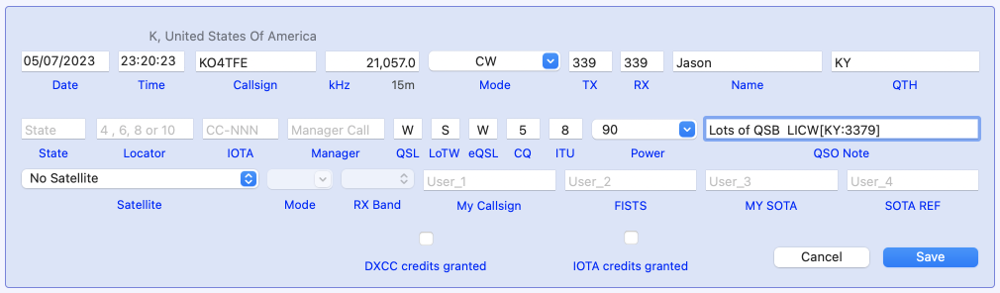

# LICW Challenge scoring
This is a Python script to parse an ADIF log file and calculate the score for the Long Island CW Club Challenge (see https://licwchallenge.org for more details)

## Log entry

When making a LICW Challenge contact, there is a minimum set of information that the participants must exchange,
but not all of this information is supported by standard ADIF log fields.

I wanted to be able to use my normal logging program to log my Challenge QSOs and the simplest solution
found was to add the extra information in the QSO note/comment field in a simple and structured way so that this
program could then reliably find and extract it in order to calculate the score.

This special text can be in addition to any other notes you enter for a QSO, can be at any position in
the note field and is case insensitive.

The minimum format of this special text string is:

```
LICW[SPC:1234xx]
```

Where:

* SPC = 2 or 3 character state/province/country code
* 1234 = the LICW membership number received from the other station
* xx = optional one or more bonus letters received from the other station



The special text string may be extended to support additional special bonus points, by
adding an optional third section containing a comma separated list of bonus conditions:

```
LICW[SPC:1234xx:EXTRA1,EXTRA2,...]
```
Where the extra fields can be one or more of:

* FIRST - for working a station on their first ever CW QSO
* F2F   - for making a QSO from a face to face meeting
* 2xF2F - for making a QSO with face to face meetings at each end

The remaining data for calculating scores is obtained from the normal QSO ADIF records.

The program will ignore all QSO records in the ADIF file that do not contain the special
LICW[] field in the QSO notes.

## Usage

The challenge scoring program is a command line script requiring Python 3 with its
default libraries; there should be no need to install anything extra.

On Linux/MacOS:

```
./challenge_score.py <adif log file name>
```

Or on Windows:

```
python challenge_score.py <adif log file name>
```

### Optional parameters

The program can optionally filter QSOs by challenge quarter, so that it can be given
a large ADIF file and just score the quarter of interest. You can either chose the
current quarter or specify which quarter you require, e.g:

Process score for the current quarter:

```
./challenge_score.py -q now all_qsos.adif
```

Or for the second quarter 2023:

```
./challenge_score.py -q 2:23 all_qsos.adif
```

### Example

```
jonathan@Mac-mini licw-challenge % ./challenge_score.py test/g4ivv_apr_23.adif

--------------------------------------------------------------------
01 Apr 23   IZ5CNC     Mark       ITA    2524   20m  1 plus 2 bonus
01 Apr 23   W2ITT      Rob         NY   263is   20m  2 plus 3 bonus
01 Apr 23   K2GV       Jerry       NY    004i   15m  2 points
01 Apr 23   KB4QQJ     Randy       NC  1086is   15m  2 plus 3 bonus
01 Apr 23   WB2UZE     Howard      NY      2a   15m  2 points
02 Apr 23   KB4QQJ     Randy       NC  1086is   20m  2 plus 3 bonus
02 Apr 23   KB4QQJ     Randy       NC  1086is   17m  2 plus 3 bonus
04 Apr 23   K2GV       Jerry       NY    004i   20m  2 points
10 Apr 23   WA2AKV     Hal         NY     77i   15m  2 points
12 Apr 23   G0POT      Michael    ENG   1071i   40m  2 plus 2 bonus
03 May 23   W4CMG      Cathy       TN   899is   20m  2 plus 3 bonus
03 May 23   W4EMB      Ed          TN  3459is   20m  2 plus 3 bonus
03 May 23   KD2YMM     Kasey       NY   3405a   20m  2 points
04 May 23   M0MCL      Kevin      ENG    4375   40m  1 plus 2 bonus
12 May 23   K9EI       Matt        IN    2467   20m  1 point
07 Jun 23   N2WBJ      Rich        NY     890   20m  1 point
--------------------------------------------------------------------

Total of 16 QSOs with 6 unique SPCs
Total score = 58
```

## FAQ

__Q__: I worked G0POT on 40m and then later a second time when he was a special station.
Do I need to go back in my log and remove the first contacts LICW[] data?

__A__: No, the program handles duplicates contacts on any given band and it will automatically
select the QSO with the highest score. So just log all LICW Challenge QSOs you make.

__Q__: The Challenge website says that if I make a QSO with a non LICW member, all points
will count if you send that station an email inviting them to join LICW. How do I log this?

__A__: Log the contact as a normal LICW challenge QSO, but with a membership number of zero.

## TODO

Not essential, but possibly nice to have:

* Support for VBand QSOs? How would this be done?

